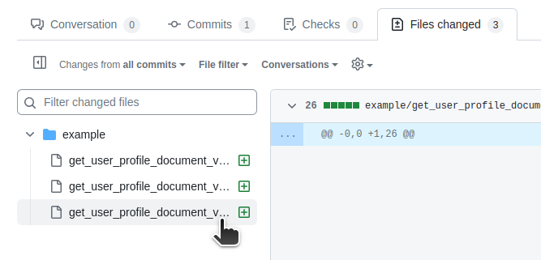
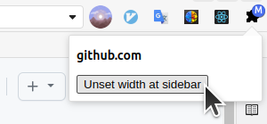
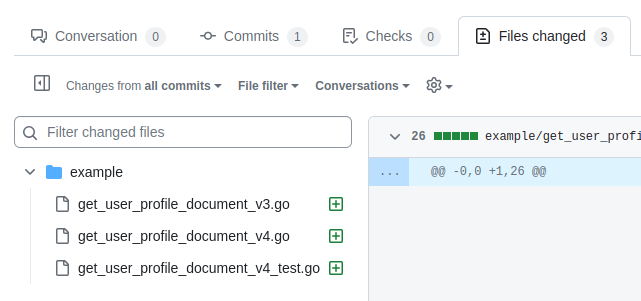
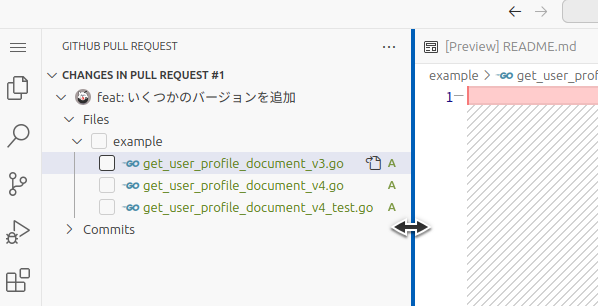

+++
draft = false
date = 2023-10-22T00:18:15+09:00
title = "chrome 拡張で github.com の .Layout-sidebar クラスに width: unset を設定する"
description = ""
slug = ""
authors = []
tags = ["chrome拡張"]
categories = []
externalLink = ""
series = []
+++

github.com の Files changed のサイドバーは横幅が固定されていて、ファイル名が長いと末尾が省略されてしまう。ファイル名の違いが末尾にあるケースでは、サイドバー上でファイル名の違いを認識できず、たまに不便を感じることがある。

## 原因

`.Layout-sidebar` クラスにあたっている `width: var(--Layout-sidebar-width);` が原因。これを打ち消せば OK。

## 解決方法

chrome 拡張をつくる

- chrome 拡張の作り方は [とほほの Chrome 拡張機能開発入門 | とほほの WWW 入門](https://www.tohoho-web.com/ex/chrome_extension.html) を参考にした。

- 「スクリプトを実行する」の内容を書き換え、「Layout-sidebar クラスをもった要素を取得して style を `width: unset` で上書きする」という処理にした。

## 結果

ボタンひとつで

ファイル名をすべて表示させるツールができた。

## まとめ

github.dev を使えば解決する。
